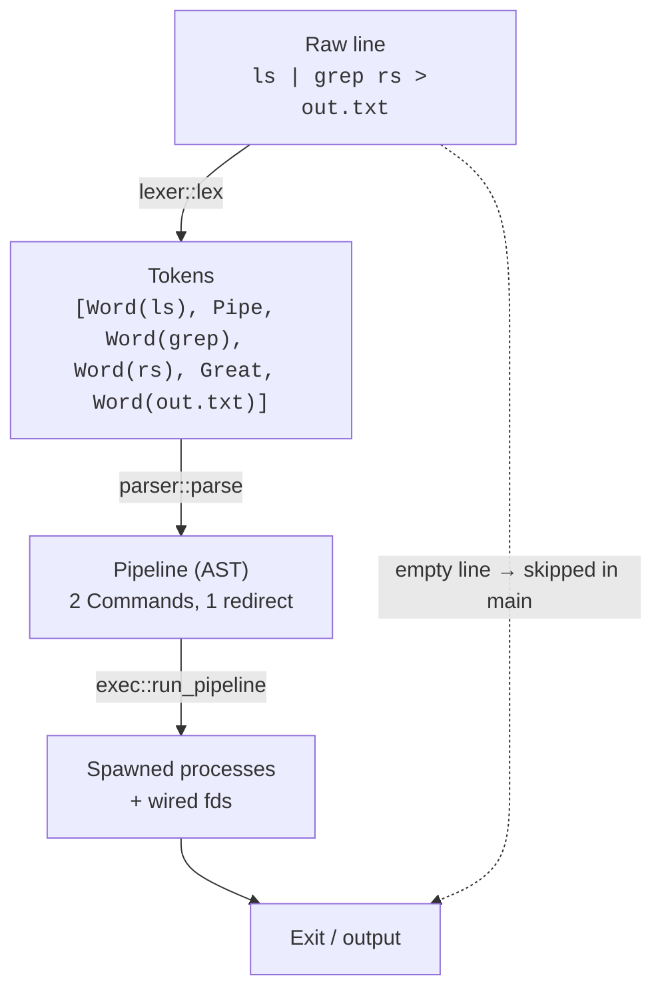
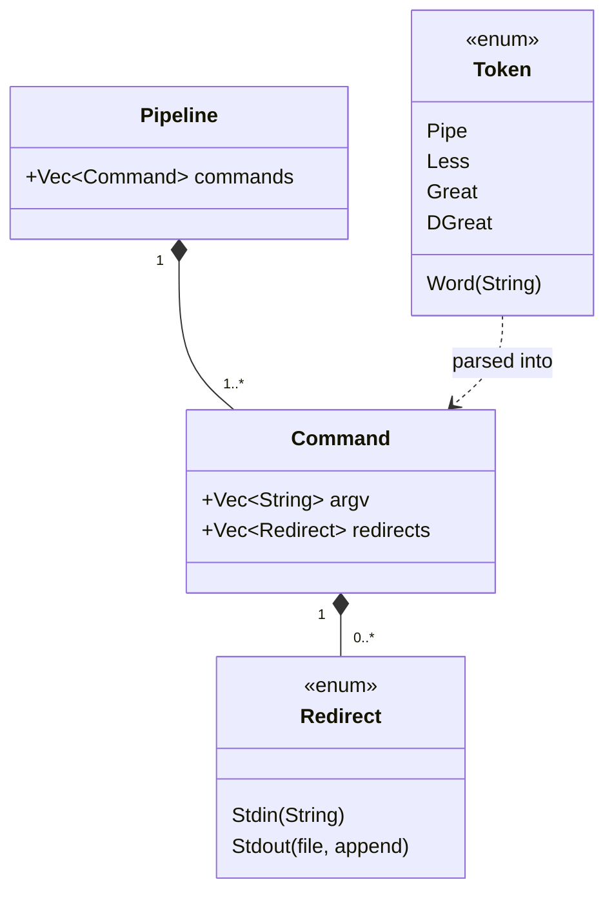
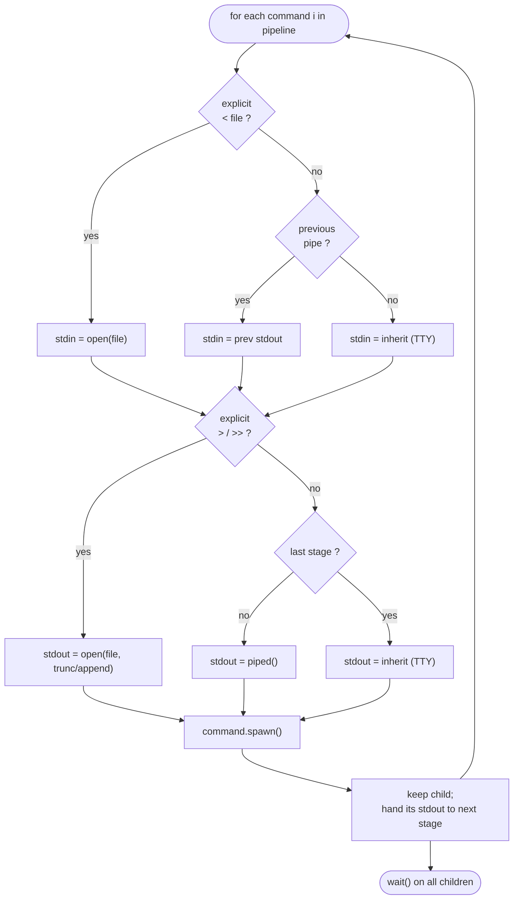
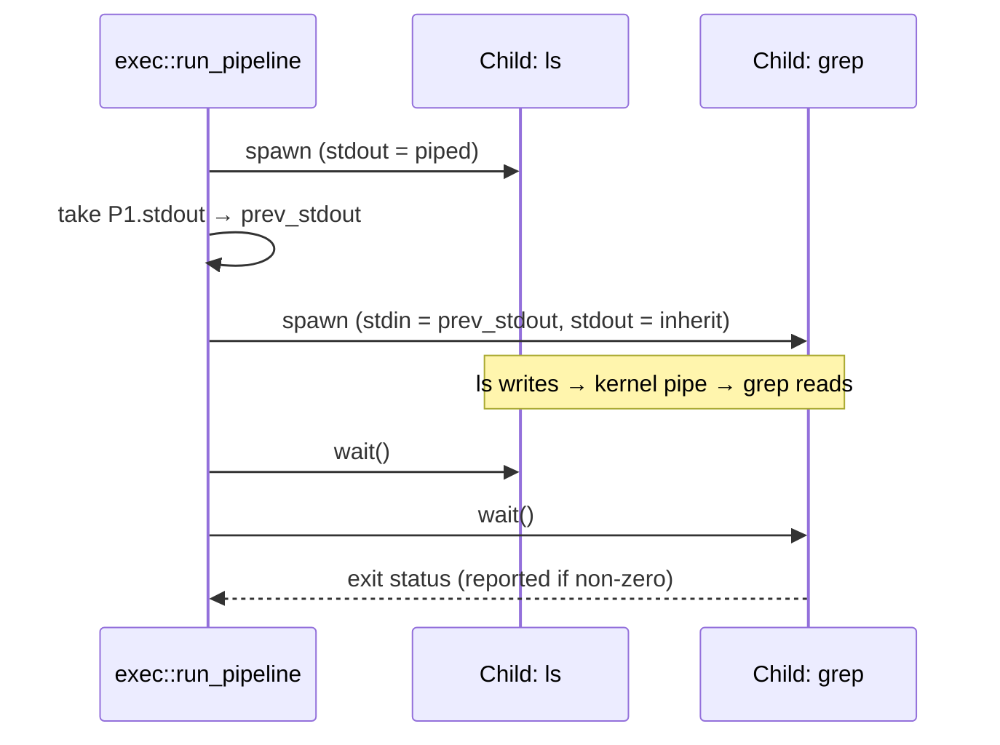
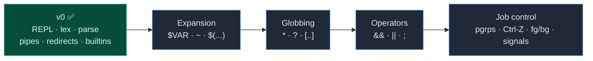

# rush — Architecture

This document describes how `rush` is structured and how a line of input flows
from your keyboard to a running process and back.

- [1. Overview](#1-overview)
- [2. The processing pipeline](#2-the-processing-pipeline)
- [3. Module reference](#3-module-reference)
- [4. Data model](#4-data-model)
- [5. Execution model](#5-execution-model)
- [6. Worked example](#6-worked-example)
- [7. Design decisions](#7-design-decisions)
- [8. Roadmap](#8-roadmap)

---

## 1. Overview

`rush` is a classic **read → parse → execute** shell. There is no background
thread, event loop, or async runtime: the main thread blocks on a line of
input, transforms it through a series of pure-ish stages, executes it, then
loops.

The codebase is intentionally small (~490 lines) and split along the stages of
that pipeline, so each module has a single, well-defined responsibility.


> Note: `parser::parse` is the public entry point; it calls `lexer::lex`
> internally. `main` never talks to the lexer directly.

---

## 2. The processing pipeline

Every non-empty line travels through four transformations. Each stage has a
narrow contract and surfaces errors as a `Result`, which `main` reports without
crashing the shell.



| Stage | Function | Input | Output | Fails on |
|---|---|---|---|---|
| Lex | `lexer::lex` | `&str` | `Vec<Token>` | unterminated `"` |
| Parse | `parser::parse` | `&str` | `Pipeline` | dangling `\|`, missing redirect target, empty command |
| Execute | `exec::run_pipeline` | `&Pipeline` | `()` | spawn failure, missing redirect file |
| Builtin | `builtins::try_run` | `&[String]` | `Option<i32>` | — (errors printed inline) |

---

## 3. Module reference

### `main.rs` — the REPL
Owns the read-eval-print loop and all I/O concerns:
- Builds the prompt from the current working directory (`cwd $ `).
- Loads `~/.rush_history` at startup and saves it on exit.
- Translates `rustyline` signals: **Ctrl-C** (`Interrupted`) abandons the line
  and continues; **Ctrl-D** (`Eof`) on an empty line breaks the loop.
- Delegates parsing and execution, printing any error as `rush: …` to stderr
  without exiting.

### `lexer.rs` — tokenizer
A hand-written, single-pass scanner over a `Peekable<Chars>`. It produces a flat
`Vec<Token>` and resolves all quoting so the parser never re-scans characters:
- **Single quotes** (`'…'`): everything literal until the closing quote.
- **Double quotes** (`"…"`): group words; backslash escapes `"` and `\`.
- **Backslash** outside quotes: escapes the next character.
- Operators `|`, `<`, `>`, `>>` become distinct tokens; `>>` is detected by
  peeking after `>`.
- An unterminated double quote is the one lexer error.

### `parser.rs` — grammar
Consumes tokens into a `Pipeline`. The grammar (v0):
```
pipeline := command ( '|' command )*
command  := word+ redirection*
redirect := ('<' | '>' | '>>') word
```
- `Word` tokens append to the current command's `argv`.
- `Pipe` finalizes the current command (erroring if it's empty) and starts a new
  one via `std::mem::replace`.
- Redirect operators consume the following word as a filename (`expect_word`),
  erroring if it isn't a word.
- A trailing empty command (e.g. `ls |`) is rejected.

### `exec.rs` — runtime
Turns a `Pipeline` into running processes:
- **Single-command fast path:** if the pipeline is one command, try
  `builtins::try_run` first so `cd`/`exit` affect the shell process.
- Otherwise spawn each stage with `std::process::Command`, threading the
  previous child's stdout into the next child's stdin.
- Redirection rules per stage: an explicit `< file` / `> file` / `>> file`
  **wins** over pipe wiring; otherwise non-final stages get a piped stdout and
  the final stage inherits the terminal.
- After spawning all stages, it waits on each child and reports a non-zero exit
  status of the last stage (non-fatal — the shell keeps running).

### `builtins.rs` — in-process commands
`try_run` returns `Some(code)` if `argv[0]` is a builtin, else `None`:
- `cd [dir]` — changes the shell's own working directory (no arg → `$HOME`).
- `pwd` — prints the current directory.
- `exit [code]` — terminates the process (diverges; defaults to `0`).

These **must** run in-process: a `cd` executed in a child would change the
child's directory and die with it, leaving the shell where it was.

---

## 4. Data model

The parser output is a small, owned AST. There is no borrowing from the input
string — every word is a `String` — which keeps lifetimes simple at v0 scale.



A `Pipeline` always has at least one `Command` (the parser guarantees this).
Each `Command` carries its full `argv` (program + arguments) and any redirects,
in source order. When multiple redirects of the same kind appear, exec uses the
**last** one (`.rev().find_map(...)`), matching shell semantics like
`cmd > a > b` writing to `b`.

---

## 5. Execution model

The interesting part is how exec wires file descriptors across pipeline stages.
For each stage it decides stdin and stdout independently:



Pipe wiring across two stages looks like this:



Key properties:
- All stages are spawned **before** any `wait()`, so they run concurrently and
  the kernel pipe buffer provides back-pressure — exactly like a real shell.
- Only the **last** stage's non-zero exit status is surfaced (and only as a
  message; v0 does not yet track `$?`).

---

## 6. Worked example

Input: `cat log.txt | grep ERROR >> errors.txt`

1. **Lex** →
   `[Word("cat"), Word("log.txt"), Pipe, Word("grep"), Word("ERROR"), DGreat, Word("errors.txt")]`
2. **Parse** → `Pipeline { commands: [`
   - `Command { argv: ["cat", "log.txt"], redirects: [] }`,
   - `Command { argv: ["grep", "ERROR"], redirects: [Stdout { file: "errors.txt", append: true }] }`
   `] }`
3. **Execute**
   - Not a single command → skip builtins.
   - Stage 0 `cat log.txt`: stdin inherits, stdout = piped (not last).
   - Stage 1 `grep ERROR`: stdin = stage 0's pipe, stdout = `errors.txt` opened
     with `append=true, truncate=false` (explicit redirect beats pipe-to-next).
   - Wait on both; report if `grep` exits non-zero.

---

## 7. Design decisions

- **Tokens carry no positions.** v0 errors are descriptive strings, not spans.
  Good enough for a REPL; revisit if we add multi-line input.
- **Owned `String`s throughout the AST.** Avoids lifetime plumbing; the input
  line is small and short-lived, so the allocation cost is irrelevant.
- **Builtins only in the single-command fast path.** A builtin mid-pipeline
  (`echo hi | cd x`) is rare and semantically fuzzy; v0 punts and would try to
  exec `cd` as an external program (which fails) — documented, not fixed.
- **Errors never kill the shell** (except `exit`). Parse and exec failures print
  to stderr and the loop continues, matching interactive-shell expectations.
- **No `nix`/`libc` yet.** Everything uses `std`. Real job control (process
  groups, `tcsetpgrp`, signal forwarding) will require dropping to `nix`, which
  is the main architectural change on the horizon.

---

## 8. Roadmap

Ordered roughly by dependency and effort:



| Milestone | Touches | Notes |
|---|---|---|
| Variable & tilde expansion | new expansion stage between parse and exec | `$VAR`, `${VAR}`, `~`, command substitution `$(...)` |
| Globbing | expansion stage | expand `*`, `?`, `[…]` against the filesystem |
| Control operators | lexer + parser + a new AST node | `&&`, `\|\|`, `;` sequence/short-circuit |
| Job control | exec rewrite on `nix` | process groups, terminal control, `Ctrl-Z`/`fg`/`bg`, signal forwarding — the headline feature for daily use |
