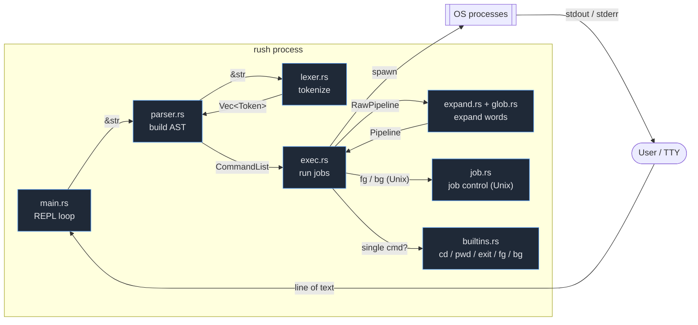
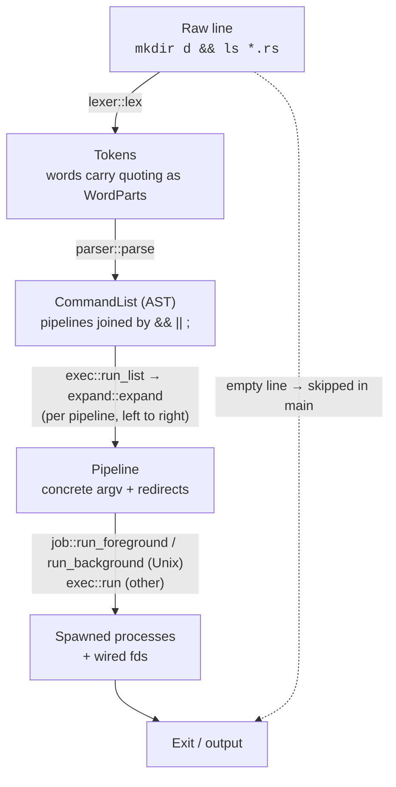
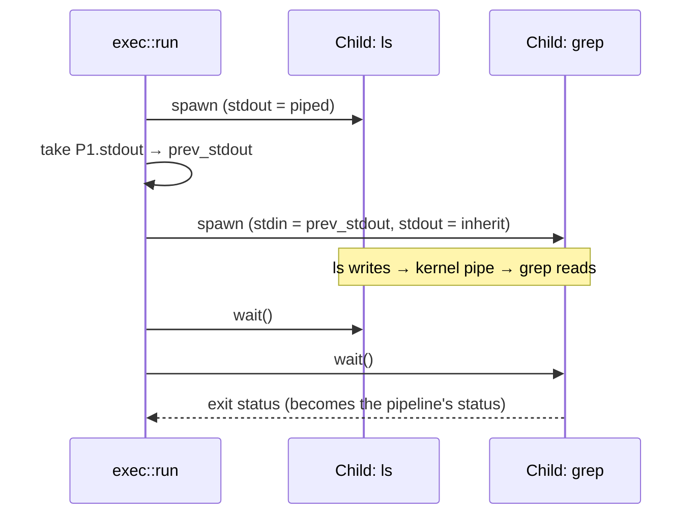

# rush — Architecture

This document describes how `rush` is structured and how a line of input flows
from your keyboard to a running process and back.

- [1. Overview](#1-overview)
- [2. The processing pipeline](#2-the-processing-pipeline)
- [3. Module reference](#3-module-reference)
- [4. Data model](#4-data-model)
- [5. Execution model](#5-execution-model)
- [6. Worked example](#6-worked-example)
- [7. Design decisions](#7-design-decisions)
- [8. Roadmap](#8-roadmap)

---

## 1. Overview

`rush` is a classic **read → parse → execute** shell. There is no event loop or
async runtime: the main thread blocks on a line of input, transforms it through
a series of pure-ish stages, executes it, then loops. (The only helper threads
are short-lived writers that feed here-document bodies to a child's stdin.)

The codebase is intentionally small and split along the stages of that
pipeline, so each module has a single, well-defined responsibility.



> Note: `parser::parse` is the public entry point; it calls `lexer::lex`
> internally. `main` never talks to the lexer directly.

---

## 2. The processing pipeline

Each command travels through a small chain of transformations. (A command may
span several input lines: when the parser returns `Incomplete`, `main` keeps
reading with a `> ` prompt and re-parses the accumulated buffer.) Each stage has
a narrow contract and surfaces errors as a `Result`, which `main` reports
without crashing the shell.



| Stage | Function | Input | Output | Fails on |
|---|---|---|---|---|
| Lex | `lexer::lex` | `&str` | `Vec<Token>` | `LexError::{Incomplete, Syntax}` (open quote/`$(`/here-doc → Incomplete) |
| Parse | `parser::parse` | `&str` | `CommandList` | bad syntax (`Syntax`) or an unfinished prefix (`Incomplete`) |
| Run list | `exec::run_list` | `&CommandList` | `i32` (status) | propagated from expand/exec |
| Expand | `expand::expand` | `&RawPipeline` | `Pipeline` | unterminated `${`/`$(`, sub-command parse error |
| Execute (fg) | `job::run_foreground` (Unix) / `exec::run` | `&Pipeline` | `i32` / `(i32, String)` | spawn failure, missing redirect file |
| Builtin | `builtins::try_run` | `&[String]` | `Option<i32>` | — (errors printed inline) |

Expansion sits deliberately between parse and exec, and runs **lazily, one
pipeline at a time** as `run_list` walks the list left to right — so `cd d &&
ls *` globs in the new directory. The parser preserves each word's quoting
(single-quoted text is literal, double-quoted and bare text may expand), and the
expansion stage resolves `~`, `$VAR`/`${VAR}`, `$(...)`, and filename globs
(`*`, `?`, `[…]`) against the environment, sub-shells, and the filesystem before
a process is spawned. Globbing can turn one word into several arguments, so the
stage is a flat-map, not a one-to-one map.

Control operators form two levels of grouping. `&&` and `||` bind a chain of
pipelines into one **job** (equal precedence, left-associative); `run_list`
decides whether to run each pipeline from the previous one's exit status (`&&`
needs `0`, `||` needs non-zero). Then `;` and `&` separate jobs, with `&`
marking the preceding job to run in the background. On Unix, foreground and
background pipelines go through `job` (process groups + terminal control); off
Unix there is no job control and `&` is an error.

---

## 3. Module reference

### `main.rs` — entry point & REPL
Dispatches on argv: `rush -c "cmds" [name args…]` and `rush FILE [args…]` set the
positional parameters and run a source string/file non-interactively (via
`run_source`); with no arguments it runs the interactive REPL, which owns the
read-eval-print loop and all I/O concerns:
- Builds the prompt: `$PS1` (shell variable, then environment — `$VAR`'s usual
  precedence), with a small rush-specific escape set expanded (`\w`/`\W` cwd,
  `\u` user, `\h` host, `\$` `#`-for-root-else-`$` — real UID via `libc`,
  Unix only, `$` elsewhere, `\?` last exit status — not a real bash escape,
  `\n`, `\\`; an unrecognized escape is kept literal). Falls back to the
  original hardcoded `cwd $ ` when `PS1` isn't set.
- Loads `~/.rush_history` at startup and saves it on exit.
- Sources `~/.rushrc` at startup, if it exists — via the same `run_source`
  used for scripts and `-c`, so an error inside it prints to stderr but
  doesn't stop the shell from starting. A missing or unreadable file is
  silently fine.
- Translates editor results: **Ctrl-C** (`Interrupted`) abandons the line
  and continues; **Ctrl-D** (`Eof`) on an empty line breaks the loop.
- Delegates parsing and execution, printing any error as `rush: …` to stderr
  without exiting.

### `editor.rs` — hand-rolled line editor
Rush's own replacement for the `rustyline` dependency. Raw terminal mode
(termios, RAII-restored), unbuffered fd-0 key decoding (UTF-8 + escape
sequences, with a short poll disambiguating a lone ESC), and a render
engine that repaints the edit region per keystroke: display-width math
(ANSI-aware, wide-character-correct via `unicode-width`), soft-wrap row
accounting with forced wraps at exact column boundaries, live syntax
highlighting, the dimmed history hint, and the `$RPS1` right prompt —
possible at all only because rush owns this layer. Keymaps: the emacs
set, plus a vi-mode subset under `set -o vi` (checked live per
`read_line`). History is in-memory with consecutive-dedup and plain-file
persistence (tolerating rustyline's old `#V2` header); Ctrl-R is an
incremental reverse search. Tab inserts the longest common completion
prefix, then prints the columned candidate list. A non-tty stdin falls
back to a plain silent read. End-to-end coverage lives in
`tests/pty/editor_pty_test.py`, driven under a real pseudo-terminal.

### `completion.rs` — tab completion
Pure candidate/hint/highlight logic the editor calls into (no trait
plumbing since the rustyline removal).
`in_command_position` is a rough, not lexer-accurate check: everything since
the last separator (`|`, `;`, `&`, `(`, newline), trimmed of leading
whitespace, contains no whitespace of its own. In command position, completes
against `builtins::all_names()` (builtins plus, on Unix, `job`'s
`jobs`/`fg`/`bg`/`kill`) and every executable found scanning `$PATH` fresh on
each call — no caching, since PATH rarely has enough entries for a linear scan
to matter. Everywhere else, falls back to plain filename completion.

### `lexer.rs` — tokenizer
A hand-written, single-pass scanner over a `Peekable<Chars>`. It produces a flat
`Vec<Token>`, stripping quote *characters* but **preserving quote context** as
`WordPart`s so the expansion stage knows what may expand:
- **Single quotes** (`'…'`) and **backslash** escapes become `Literal` parts —
  never expanded.
- **Double quotes** (`"…"`) become `Quoted` parts; backslash escapes `"`, `\`,
  and `$`.
- Bare text becomes `Unquoted` parts (eligible for `~`, `$`, and later glob).
- A `$(...)` substitution is swallowed whole — balanced parens, quotes and all —
  so inner spaces and `|` don't split the word.
- Operators `|`, `&`, `&&`, `||`, `;`, `;;`, `(`, `)` become distinct tokens, as
  do redirections — `<`, `>`, `>>`, an optional leading fd (`2>`), `>&n`
  (`2>&1`), and `&>`/`&>>` — carried in a `Redirect { fd, op }` token. (Bare
  parens are operators — for `case`/future subshells — so a literal paren in a
  command must be quoted.)
- A `#` at a word boundary starts a comment: lexing stops for the rest of the
  line. Mid-word (`foo#bar`) or quoted, `#` is an ordinary character.
- `<<DELIM` here-documents: the delimiter is read, and after the line's newline
  the body is collected up to a line equal to `DELIM` (`<<-` strips leading
  tabs; a quoted delimiter disables expansion). The body rides along in the
  `Heredoc` redirect op.
- `lex` returns `LexError::{Incomplete, Syntax}`. An open quote, `$(`, `${`, or
  here-doc is **`Incomplete`** — the REPL keeps reading (so quotes and here-docs
  can span lines); a bad fd is `Syntax`.

### `parser.rs` — grammar
A recursive-descent parser over a `Vec<Token>` cursor, producing a `CommandList`
(a `Vec<Job>`) whose commands may be simple or compound. The grammar (v0):
```
list     := and_or ( sep and_or )* sep?          sep = ; | & | newline
and_or   := pipeline ( ('&&' | '||') pipeline )*
pipeline := command ( '|' command )*
command  := compound | simple
compound := if_clause | loop_clause | for_clause | case_clause | group | funcdef
simple   := (word | redirect)+
redirect := ('<' | '>' | '>>') word

case_clause := 'case' word 'in' ( '('? pattern ('|' pattern)* ')' list ';;' )* 'esac'
group       := '{' list '}'
subshell    := '(' list ')'
funcdef     := NAME '(' ')' group
```
`{` and `}` are reserved words recognised in command position (so a literal
brace must be quoted or attached to a word, e.g. `{a,b}` is a plain word).
- `parse_command` dispatches on a **reserved word** in command position (`if`,
  `while`, `until`, `for`) to a compound parser; otherwise `parse_simple` reads
  words and redirects. After the first word, reserved words are ordinary
  arguments (`echo done` is fine), and a list ends at a closing keyword
  (`then`/`fi`/`do`/`done`/…).
- Newlines are their own token, so input can span lines and `&&`/`||`/`|` can
  continue onto the next line.
- `ParseError` distinguishes **`Incomplete`** (a valid prefix that needs more
  input — the REPL keeps reading with a `> ` prompt) from **`Syntax`** (a real
  error). Reaching end of input mid-construct (`if x; then …`) is `Incomplete`;
  a stray `fi` is `Syntax`.

### `expand.rs` — expansion
Lowers a `RawPipeline` into an `exec::Pipeline` of concrete strings:
- **Tilde:** a leading `~` on the first, unquoted part of a word becomes `$HOME`
  (falling back to `$USERPROFILE`); `~user` is left untouched.
- **Variables:** `$VAR` and `${VAR}` resolve to a shell variable (`vars`) if set,
  else the environment, else empty. `$?` is the last exit status; `$0`–`$9`/
  `${10}` the positional parameters; `$#` their count; `$@`/`$*` all of them
  (a standalone `"$@"` keeps each parameter as its own argument). `${...}` also supports the default/alternate operators `:-` `-` `:=`
  `=` `:+` `+` `:?` `?` (a colon also treats *empty* as unset), `${#name}` for
  length, and the pattern-removal family `#`/`##`/`%`/`%%` — no colon form,
  since bash doesn't define one either — which strip a matching prefix/suffix
  (`strip_prefix_pattern`/`strip_suffix_pattern`): the operand is a glob
  pattern (the same matcher `case` patterns use), and `#`/`%` remove the
  *shortest* match while `##`/`%%` remove the *longest*, found by trying
  candidate cut points in the corresponding direction and taking the first
  one that fully matches (`expand_braced`). Leading `NAME=value` words on a
  command are
  split off as assignments (`expand_command`): with no program word they set
  shell variables, otherwise they seed that command's environment (alongside
  exported variables).
- **Command substitution:** `$(...)` re-enters `parse → expand` on the inner
  text and runs it via `exec::capture`, inlining stdout with trailing newlines
  trimmed.
- **Arithmetic:** `$((expr))` is evaluated by `arith::eval` and inlined as its
  integer result (`$(` vs `$((` is decided by a second peek).
- **Word-splitting:** `$IFS` inside an *unquoted* expansion splits the word into
  fields (`x="a b"; echo $x` → two args). A `Splitter` assembles the word's
  parts into fields: quoted/literal text is added unsplit, unquoted-expansion
  text splits on `$IFS` characters (`Ifs`, computed once per word). Unset IFS
  defaults to space/tab/newline (and since the lexer already split on literal
  whitespace, any whitespace left in an unquoted part in that default case
  must have come from an expansion); an explicit empty `IFS=` disables
  splitting entirely. A custom IFS value's space/tab/newline characters
  collapse like the default (no empty fields from a run); every other
  character is a "non-whitespace" delimiter where each occurrence opens a
  field on its own, even empty (`IFS=,` on `a,,b` is three fields) — except a
  single trailing one at the very end of the text, which produces no trailing
  empty field (matching bash's own asymmetry there). `$*`/`${*}` join
  positional parameters with `$IFS`'s first character instead of a hardcoded
  space; `$@` is unaffected.
- **Globbing:** each field carries a glob *pattern* alongside its plain text,
  escaping metacharacters from quoted/literal parts so only unquoted `*?[` stay
  active. A field that matches files (via `glob::glob`) is replaced by the
  sorted matches; otherwise its literal text is kept (POSIX no-match).
- **Emptiness:** a field that is entirely unquoted and empty (e.g. `$UNSET`)
  drops out, mirroring shell field-splitting; a quoted empty (`""`) is kept.

### `func.rs` — shell functions
A thread-local `name → CommandList` registry. A `FuncDef` compound stores its
body here; a simple command whose name matches a function (checked before
builtins/spawn) is run by `exec::call_function`, which swaps in the call's
arguments as `$1`… (keeping `$0`), runs the body, consumes any pending `return`,
and restores the previous positional parameters. Functions may recurse.

### `alias.rs` — aliases
A thread-local `name → value` table (`BTreeMap`, so listing is name-sorted).
`expand.rs`'s `expand_simple` does the substitution: if a simple command's
first word (after variable/glob expansion) names an alias, it's replaced by
the alias value's whitespace-split words, in place, before the command is
checked against functions/builtins/external programs. This is a *single*
substitution — the expanded words aren't re-checked against the alias table —
so `alias ls='ls --color=auto'` can't self-recurse. No support (yet) for a
trailing-space alias expanding the *next* word too.

### `trap.rs` — signal-name traps
A thread-local `name → command` table for `trap 'command' NAME`. Only `EXIT`
and `INT` are ever fired. `fire(name)` parses and runs the registered command
(via `exec::run_list`, discarding its status), guarded against re-entrancy (a
`FIRING` set) so an `EXIT` trap that itself calls `exit` can't recurse
forever. `exit_shell(code)` — fire `EXIT`, then `std::process::exit(code)` —
replaces every direct `std::process::exit` call on an expected exit path
(the `exit` builtin, `errexit`, a forked subshell's own exit, and `main.rs`'s
script/`-c`/interactive-Ctrl-D paths) so a registered `EXIT` trap reliably
fires exactly once, from whichever path triggered it. `INT` fires from
`main.rs`'s idle-prompt Ctrl-C handling only — a running foreground job is a
child process under job control and never delivers `SIGINT` to the shell
itself, so that case isn't (yet) covered.

### `arith.rs` — integer arithmetic
A self-contained tokenizer + recursive-descent evaluator over `i64` for
`$((...))`: `+ - * / %`, unary `+ - !`, comparisons, `&&`/`||`, parentheses, and
bare variable names (resolved like `$name`, unset → `0`). Comparisons and
logicals yield `1`/`0`. No assignment/increment inside the expression yet.

### `glob.rs` — filename matching
A from-scratch globber, no external crate:
- `match_component` matches one path component with `*` (within a component),
  `?`, `[…]` (ranges and `[!…]`/`[^…]` negation); a backslash escapes the next
  character so quoted metacharacters are literal.
- `glob` walks the filesystem component-by-component, so `src/*.rs` and
  `*/*.rs` descend directories. A leading `.` in a filename matches only when
  the pattern component begins with a literal `.`, so `*` skips dotfiles.

### `vars.rs` — shell state
Thread-local state that outlives a single command: the last exit status (`$?`),
shell variables (value + exported flag), positional parameters (`$0`, `$1`…),
and the pending control-flow request (`break`/`continue`/`return`) that `exec`
consults via `flow_pending()`. Lookups for `$VAR` consult this map first and
fall back to the environment; only *exported* variables are pushed into child
processes. `snapshot`/`restore` (`#[cfg(not(unix))]`) back the non-Unix
subshell approximation — see `exec.rs`'s `Compound::Subshell` notes below; a
real fork needs neither.

A separate, one-shot marker — `reset_last_subst_status`/
`set_last_subst_status`/`take_last_subst_status` — gives a
variable-assignment-only command (`x=$(false)`) POSIX's exit-status rule:
its status is that of the last command substitution performed while
expanding it, not always `0`. `run_foreground`/`capture_pipeline` reset the
marker right before calling `expand::expand`, and `capture_list` (the engine
behind every `$(...)`) sets it — to whatever its own last job's status was —
right after finishing; the assignment-only branch then takes (consumes) it,
falling back to `0` if no substitution ran. This is *not* the same
thread-local as `$?` itself: reusing `$?`'s own slot as a sentinel here would
corrupt a direct `x=$?` read (no substitution at all) happening in the same
expansion. Because the reset/consume pair brackets exactly one `expand()`
call, nested substitutions (`x=$(y=$(false); echo inner)`) resolve correctly
without a stack: by the time an outer level consumes the marker, only the
inner level closest to it — which already consumed and moved past its own —
could have last written it.

### `exec.rs` — runtime
Sequences a `CommandList` and turns each pipeline into running processes:
- `run_list` runs each job in turn. A foreground job runs its `&&`/`||` chain
  via `run_andor`, expanding each `RawPipeline` *just before* it runs and using
  `should_run(connector, prev_status)` to short-circuit. A background job (one
  pipeline) is handed to `run_background`.
- `capture_list` runs every job in the foreground with a plain spawn-and-wait
  and concatenates stdout — the engine behind `$(...)` (the `&` marker is
  ignored inside a substitution). Like `run_andor`, `capture_pipeline` updates
  `$?` after every pipeline, so e.g. `$(false; echo $?)` sees `1` from within
  the substitution, not whatever `$?` was from outside it. A pipeline that's
  a single compound command is captured via `capture_compound`: fork (Unix
  only) and redirect the *child's* fd 1 to a pipe before running
  `run_compound` there, so everything the child writes — in-process
  (builtins) or via a further spawn that inherits its stdout — ends up
  captured. Only a pipeline that *is* a single compound is handled this way;
  one as one stage among several in a larger pipeline *inside a
  substitution* still errors here (`run` — see below — rejects a
  `Stage::Compound` explicitly) — this narrower case remains a documented
  limitation, distinct from the general case, which `job::spawn_pipeline`
  now handles (C3; see the `job.rs` section below).
- **Single-command fast path:** if a pipeline is one command naming a builtin
  (`builtins::is_builtin`), it runs via `run_builtin_foreground` so `cd`/
  `exit`/`jobs` affect the shell process (skipped when capturing, so
  substitutions see external commands). Builtins write via `println!`/
  `eprintln!` straight to the process's real stdio, so a redirect on one
  (`echo hi > f`) can't be handed to a child the way `build_stage` hands
  redirects to an external command's `Command`; instead, on Unix,
  `redirect_stdio` temporarily `dup2`s the shell's own fd 0/1/2 to match,
  running the builtin, then restores the originals (`StdioGuard`'s `Drop`, so
  a redirect that fails partway through still restores whatever it already
  touched). Off Unix, a builtin's redirects are silently ignored — no raw
  `dup2` equivalent in play (see the Windows note above). This only covers a
  builtin as the *sole* command of a pipeline — one in the middle of a
  multi-stage pipe (`echo hi | cd`) is still the pre-existing punt: rush
  tries to exec it as an external program and fails.
- **Redirects trailing a compound command's close** (`while …; done < file`,
  `{ …; } > log`, C7's prerequisite fix): the parser attaches them to the
  compound itself (`RawCompound`/`exec::CompoundStage`, alongside a here-doc
  body, mirroring `Command`'s own `redirects`/`heredoc` split) rather than
  leaving them to become a stray no-op command afterward, which is what used
  to happen — silently, no parse error, so `done < file` never wired the
  file to fd 0 at all. Applied via the *same* `redirect_stdio` a lone builtin
  uses, wrapping the whole compound's execution instead of one builtin call
  (`run_compound_with_redirects`), reused unchanged for a compound as one
  stage of a real pipeline (`job::spawn_compound_stage`, forked — the guard
  is deliberately never restored there, since that child exits right after)
  and for capturing a sole compound via `$(...)` (`capture_compound`), with
  the same "explicit redirect overrides implicit pipe/capture wiring"
  precedence `build_stage` already uses for simple commands. A trailing
  here-doc is fed through a `CLOEXEC`-marked pipe from a background thread
  (`set_cloexec`) — without that, a real child spawned from the compound's
  body before the writer thread finished would inherit its own copy of the
  write end via fork/exec, and the reader would never see EOF (a real
  deadlock found while testing this).
- `build_stage` constructs one stage's `std::process::Command` and stdio. It
  resolves fd 0/1/2 to `Sink`s (inherit / pipe / file), applying redirects in
  source order — so `> f 2>&1` sends both to `f` (the dup `try_clone`s the file
  handle) while `2>&1 > f` leaves stderr on the terminal. A non-final stage (or
  any stage when capturing) defaults fd 1 to a pipe. Shared by the plain runner
  and the Unix job runner. `Stdio::piped()` doesn't expose its pipe's write end
  before spawn, so a plain `Sink::Pipe` can't be shared with a second
  descriptor as-is; when `2>&1` targets one, `clone_or_materialize` builds a
  real OS pipe by hand (`make_pipe`, Unix only) so stdout and stderr get
  independent fds onto the *same* pipe — `cmd 2>&1 | next` and
  `x=$(cmd 2>&1)` both route stderr through correctly. The manually-created
  pipe's write end must be dropped in the parent (`drop(command)`) before
  reading the read end back — an ordinary file redirect doesn't care, but a
  parent-side copy of a *pipe's* write end left open stops the reader from
  ever seeing EOF.
- On Unix, foreground/background spawning, terminal control, and waiting live in
  `job` (below). Off Unix, `run` spawns each stage, threads stdout→stdin, waits,
  and reports the last stage's exit code as the pipeline status.
- **Compound commands:** a pipeline that is a single `if`/`while`/`for` is run
  by `run_compound`, which recurses through `run_list` on the condition and body
  lists — so control flow nests naturally and reuses the same status plumbing
  (`if`/`while` branch on a list's exit status; `for` expands its word list via
  `expand::expand_words` and sets the loop variable each iteration — unless
  the `in` clause was omitted entirely (`Compound::For`'s `has_in` flag, set
  by the parser), in which case it iterates `vars::args()` (`"$@"`) instead,
  per POSIX — distinct from an *explicit* `in` with zero words, which is a
  real empty list; `case` matches the subject against each pattern with
  `glob::match_component`).
  `Compound::Subshell` forks a real child on Unix (`run_subshell_forked`): the
  parent just waits and adopts the child's exit status, so `(cd x; …)`,
  `(VAR=…; …)`, and even `exit` inside `(…)` are genuinely isolated — none of
  it can leak back, because it happens in a separate process. Off Unix (no
  `fork`), it falls back to `vars::snapshot`/`restore` plus saving/restoring
  the cwd, which can't contain an `exit`. A compound as *one stage among
  several* in a multi-command pipeline (e.g. `(cmd) | grep x`) now works too
  (C3), for the interactive/script job-control path — `expand::expand` no
  longer rejects it (a `Pipeline` is `Vec<Stage>`, `Stage::Simple` or
  `Stage::Compound`, carried through unexpanded); see `job.rs`'s
  `spawn_compound_stage` below for how it's actually run. The narrower case
  of a compound as one stage *inside a `$(...)` substitution*, or on
  non-Unix (no `fork` there at all), still errors clearly (`run`, in this
  same file, rejects a `Stage::Compound` explicitly rather than mishandling
  it).
- **`break`/`continue`/`return`:** those builtins set a thread-local request in
  `vars`; `exec_list`/`run_andor` stop early when `flow_pending()` is true. Each
  loop's `loop_step` consumes one `break`/`continue` level (so `break 2` escapes
  two loops) and lets `return` pass through; `call_function` consumes `return`.
  The public `run_list` clears anything that escapes every loop and function.
- **`errexit` (`set -e`):** `exec_list` is actually `exec_list_impl(list,
  check_errexit)` — after each job, if `check_errexit && vars::errexit() &&
  status != 0 && last_ran`, it calls `trap::exit_shell(status)`. `if`/`while`/`until`
  conditions run through `exec_cond` (`check_errexit = false`) instead, since
  bash exempts them — a failing condition is the normal way to end a loop or
  skip a branch, not a script error. `last_ran` matches bash's actual errexit
  rule (see the doc comment on `exec_list_impl`): `run_job`/`run_andor` report
  whether the textually-last pipeline in a job's `&&`/`||` chain actually ran,
  as opposed to being skipped by short-circuiting — `set -e; false && true`
  survives (`false` isn't last), `set -e; true && false` exits (`false` is).

**Tests:** `exec.rs`'s own runtime behavior — pipeline wiring, redirection
routing, exit-status propagation and short-circuiting, compound status,
`2>&1`-into-a-pipe (G10 regression lock-in), forked-subshell `exit` isolation
(G10 regression lock-in) — is covered black-box, against the compiled binary,
in `tests/exec_behavior.rs` rather than an in-crate `#[cfg(test)]` module.
That turned out to matter: a hand-rolled in-process helper (`parser::parse` +
`run_list`/`capture_list`) has real footguns for this — `capture_list` never
tracks `$?` across jobs (it's built only for concatenating `$(...)` output,
not for replaying whole-script semantics) and rejects any compound command
outright, and a builtin's redirects are wired up via a process-wide `dup2`
around the call (`run_builtin_foreground`) that races across `cargo test`'s
concurrently-running threads since fd 0/1/2 aren't per-thread. A genuinely
separate process per test sidesteps all of that. (Three things this
surfaced — `capture_list`'s `$?` gap, its blanket rejection of compound
commands even a lone one, and a command substitution's status not
propagating to an assignment's own status — are all now fixed; see
`capture_pipeline`/`capture_compound` above and `vars`'s
`reset_last_subst_status`/`take_last_subst_status` below.)

### `job.rs` — Unix job control *(compiled only on Unix)*

**Windows strategy (G11):** `#[cfg(unix)]`/`#[cfg(not(unix))]` are decided by
the Rust *target triple*, not the build/shell environment — there's no
"building under MSYS2" distinct from "building for Windows normally." MSYS2
just packages the same mingw-w64 GNU toolchain rustup uses for the standard
`x86_64-pc-windows-gnu` target, which — like `x86_64-pc-windows-msvc` — has
`cfg(windows)`, never `cfg(unix)`. Verified directly, not just reasoned:
cross-compiling with that same mingw-w64 toolchain (`rustup target add
x86_64-pc-windows-gnu`, `apt install mingw-w64`, `cargo build --release
--target x86_64-pc-windows-gnu`) succeeds and produces a genuine `PE32+
executable ... for MS Windows`; `cargo tree --target x86_64-pc-windows-gnu`
confirms rush's own `libc` dependency (`[target.'cfg(unix)'.dependencies]` in
`Cargo.toml`) is excluded for that target, so `job.rs` (`#[cfg(unix)] mod
job;` in `main.rs`) never compiles in — there is no code path, on any
Rust-supported Windows target, that can produce a job-control-capable
Windows binary. So **the "MSYS2 = full job control" half of this gap's
original framing doesn't hold**: every Windows build, via MSYS2 or otherwise,
is foreground-only, unconditionally, by construction — not merely "by
design" as a choice not yet revisited, but because `job.rs`'s POSIX
`libc` calls (`setpgid`, `tcsetpgrp`, `WIFSTOPPED`, …) have no Windows
equivalent wired up, and no supported target sets `cfg(unix)` on Windows to
even reach that code. (Not validated: actually *running* the cross-compiled
binary — this sandbox has no Windows machine, and a Wine install attempt
failed on an unrelated package-repository error. Unnecessary for the
job-control conclusion above, though, since that's decided statically by
which code compiles in, not by anything only observable at runtime.)

Implements the parts that need POSIX process groups and signals, via the `libc`
crate, following the classic glibc job-control structure:
- `init` (called once at startup, only when stdin is a tty) ignores the
  job-control signals (`SIGINT`, `SIGTSTP`, …) in the shell, puts the shell in
  its own process group, and grabs the terminal.
- `spawn_pipeline` launches every stage into one new process group; each child
  resets those signals to default and `setpgid`s before `exec` (via
  `CommandExt::pre_exec`), so Ctrl-C/Ctrl-Z reach the job, not the shell. A
  `Stage::Compound` stage (C3) instead goes through `spawn_compound_stage`,
  which forks directly (no `exec`, since it's running `run_compound` in
  Rust, not a separate program) — the same `setpgid`/signal-reset happens
  by hand in the child rather than via `pre_exec`, and stdin/stdout are
  wired with a real `dup2` from `File`s, not `Stdio`: a forked child needs
  something introspectable (`.as_raw_fd()`) to `dup2` from, and `Stdio` is
  built only for handing to a `Command`, not reading back out of. This is
  why the inter-stage connector in this function is `Option<File>`, not
  `Option<Stdio>` — a `Simple` stage converts it with `Stdio::from(file)`
  right where it's fed into `build_stage`; a `ChildStdout` gets rewrapped as
  a `File` via `IntoRawFd`/`FromRawFd` so both stage kinds share the same
  connector type uniformly, regardless of which kind is on either side of a
  junction.
- `run_foreground` hands the job the terminal (`tcsetpgrp`), waits with
  `WUNTRACED` (so a Ctrl-Z stop is detected and recorded), then reclaims the
  terminal. `run_background` records the job and prints `[id] pgid`.
- A thread-local job table backs `jobs`/`fg`/`bg`/`kill` and the
  `reap_background` sweep run before each prompt (a non-blocking `waitpid` that
  reports finished, stopped, and continued jobs). `kill [-SIG] %n|pid` signals a
  job's process group (via `killpg`) or a process.

**Tests:** an in-crate `#[cfg(test)] mod tests` at the end of this file,
constructing `exec::Pipeline`/`Command` values directly (both are plain
public structs) rather than going through the parser — covers
`run_foreground`'s exit-status reporting for a single command, a multi-stage
pipeline (only the last stage's status counts), and a signal-killed child
(the conventional `128 + signal`, via a real `SIGTERM`, not a hand-encoded
wait status). None of these call `init()` with a real tty (there isn't one
under `cargo test`), so `job_control_enabled()` stays false throughout —
`give_terminal`/`reclaim_terminal` are no-ops, same as running rush
non-interactively, which is exactly the path exercised. A fourth test drives
the job-table bookkeeping (`update_by_pid`/`notify_and_prune`) directly
rather than through the public `reap_background`, since *that* function does
gate on `job_control_enabled()` (real job control needs a tty to hand the
terminal back to) and would silently no-op here.

### `builtins.rs` — in-process commands
`try_run` returns `Some(code)` if `argv[0]` is a builtin, else `None`:
- `cd [dir]` — changes the shell's own working directory (no arg → `$HOME`).
- `pwd` — prints the current directory.
- `echo [-n] [args…]` — joins args with spaces (no `-e` escapes).
- `export NAME[=value]` — marks a shell variable exported (see `vars`).
- `unset NAME…` — removes shell variables.
- `test EXPR` / `[ EXPR ]` — file tests (`-e`/`-f`/`-d`/`-s`/…), string
  `-z`/`-n`/`=`/`!=`, integer `-eq`/`-lt`/… and a leading `!`; status `0`/`1`.
- `true` / `:` (status `0`) and `false` (status `1`).
- `break [n]` / `continue [n]` — record a loop-control request (via `vars`)
  that `exec::run_compound` consumes one level at a time.
- `return [n]` — unwind the current function (default status `$?`).
- `exit [code]` — terminates the process (diverges; defaults to `0`).
- On Unix, `jobs`/`fg`/`bg` are dispatched to `job::builtin`.

These **must** run in-process: a `cd` executed in a child would change the
child's directory and die with it; `fg`/`bg` must manipulate the shell's own
job table and terminal.

---

## 4. Data model

The data model is a small, owned AST in two layers: the parser's **raw** form,
where words keep their quoting (`Vec<WordPart>`), and exec's **resolved** form,
where every word is a concrete `String`. The expansion stage maps the first onto
the second. There is no borrowing from the input string, which keeps lifetimes
simple at v0 scale.

```mermaid
classDiagram
    class Token {
        <<enum>>
        Word(Vec~WordPart~)
        Pipe
        Less
        Great
        DGreat
    }
    class WordPart {
        <<enum>>
        Literal(String)
        Unquoted(String)
        Quoted(String)
    }
    class CommandList {
        +Vec~Job~ jobs
    }
    class Job {
        +AndOrList list
        +bool background
    }
    class AndOrList {
        +RawPipeline first
        +Vec~(Connector, RawPipeline)~ rest
    }
    class Connector {
        <<enum>>
        And
        Or
    }
    class RawPipeline {
        +Vec~RawCommand~ commands
    }
    class RawCommand {
        <<enum>>
        Simple(RawSimple)
        Compound(Box~Compound~)
    }
    class RawSimple {
        +Vec~Word~ argv
        +Vec~RawRedirect~ redirects
    }
    class Compound {
        <<enum>>
        If(branches, else)
        Loop(until, cond, body)
        For(var, words, body)
        Case(word, items)
        Group(list)
        Subshell(list)
        FuncDef(name, body)
    }
    class Pipeline {
        +Vec~Command~ commands
    }
    class Command {
        +Vec~String~ argv
        +Vec~Redirect~ redirects
        +Vec~(String, String)~ assignments
    }
    class Redirect {
        <<enum>>
        File(fd, file, mode)
        Both(file, append)
        Dup(fd, target)
    }

    Token *-- WordPart
    CommandList "1" *-- "1..*" Job
    Job "1" *-- "1" AndOrList
    AndOrList "1" *-- "1..*" RawPipeline
    AndOrList ..> Connector : joins with
    RawPipeline "1" *-- "1..*" RawCommand
    RawCommand ..> RawSimple : Simple
    RawCommand ..> Compound : Compound
    Compound ..> CommandList : bodies
    Pipeline "1" *-- "1..*" Command
    Command "1" *-- "0..*" Redirect
    Token ..> RawSimple : parsed into
    RawPipeline ..> Pipeline : expand::expand
```

A `Pipeline` always has at least one `Command` (the parser guarantees this).
Each `Command` carries its full `argv` (program + arguments) and any redirects,
in source order. When multiple redirects of the same kind appear, exec uses the
**last** one (`.rev().find_map(...)`), matching shell semantics like
`cmd > a > b` writing to `b`.

---

## 5. Execution model

The interesting part is how exec wires file descriptors across pipeline stages.
For each stage it decides stdin and stdout independently:


Pipe wiring across two stages looks like this:



Key properties:
- All stages are spawned **before** any `wait()`, so they run concurrently and
  the kernel pipe buffer provides back-pressure — exactly like a real shell.
- The **last** stage's exit code is the pipeline's status, which feeds the
  `&&`/`||` decision in `run_list`. (v0 does not yet expose it as `$?`.)

---

## 6. Worked example

Input: `cat log.txt | grep ERROR >> errors.txt`

1. **Lex** →
   `[Word("cat"), Word("log.txt"), Pipe, Word("grep"), Word("ERROR"), DGreat, Word("errors.txt")]`
2. **Parse** → one job, one and-or, one `RawPipeline { commands: [`
   - `Simple(RawSimple { argv: [["cat"], ["log.txt"]], redirects: [] })`,
   - `Simple(RawSimple { argv: [["grep"], ["ERROR"]], redirects: [File { fd: 1, "errors.txt", Append }] })`
   `] }` (no operators or compounds)
3. **Run list / Expand** → the single pipeline is expanded (here a no-op — no
   `$`, `~`, or globs) into the concrete `Pipeline` of `String` argv.
4. **Execute**
   - Not a single command → skip builtins.
   - Stage 0 `cat log.txt`: stdin inherits, stdout = piped (not last).
   - Stage 1 `grep ERROR`: stdin = stage 0's pipe, stdout = `errors.txt` opened
     with `append=true, truncate=false` (explicit redirect beats pipe-to-next).
   - Wait on both; `grep`'s exit code becomes the pipeline's (and the list's)
     status.

---

## 7. Design decisions

- **Tokens carry no positions.** v0 errors are descriptive strings, not spans.
  Good enough for a REPL; revisit if we add multi-line input.
- **Owned `String`s throughout the AST.** Avoids lifetime plumbing; the input
  line is small and short-lived, so the allocation cost is irrelevant.
- **Builtins only in the single-command fast path.** A builtin mid-pipeline
  (`echo hi | cd x`) is rare and semantically fuzzy; v0 punts and would try to
  exec `cd` as an external program (which fails) — documented, not fixed.
- **Errors never kill the shell** (except `exit`). Parse and exec failures print
  to stderr and the loop continues, matching interactive-shell expectations.
- **`libc` only where it's unavoidable.** Everything except job control uses
  `std`. Job control (process groups, `tcsetpgrp`, `waitpid(WUNTRACED)`, signal
  handling) needs raw POSIX, so `job.rs` uses `libc` directly and is gated to
  `#[cfg(unix)]`; `libc` is a `[target.'cfg(unix)'.dependencies]` entry, so
  Windows builds never pull it. Off Unix the shell degrades to foreground-only.
- **Job control follows the glibc reference.** The shell ignores the
  job-control signals and owns the terminal; each child resets them and joins
  the job's process group before `exec`; the terminal is handed to the
  foreground job and reclaimed when it stops or exits.

---

## 8. Roadmap

Ordered roughly by dependency and effort:


| Milestone | Touches | Notes |
|---|---|---|
| Variable & tilde expansion | ✅ `expand.rs`, between parse and exec | `$VAR`, `${VAR}`, `~`, command substitution `$(...)`; no word-splitting yet |
| Globbing | ✅ `glob.rs`, driven from the expansion stage | `*`, `?`, `[…]` with ranges/negation, multi-component, dotfile rule |
| Control operators | ✅ lexer + parser `CommandList` + `exec::run_list` | `&&`, `\|\|`, `;` sequence/short-circuit by exit status |
| Job control | ✅ `job.rs` (`#[cfg(unix)]`, `libc`) | `&`, process groups, terminal control, `Ctrl-Z`/`fg`/`bg`/`jobs`, signals |

All four roadmap milestones are in, plus a good deal beyond: word-splitting,
shell variables/`export`/`unset`, `$?`, the `${VAR:-default}` family, comments,
more builtins (`echo`, `true`/`false`/`:`), and control flow (`if`/`while`/
`for`, single- or multi-line).

With `test`/`[`, `$((…))`, and control flow, real scripts work — e.g. a
counting `while [ $i -le 3 ]; do …; i=$((i+1)); done`, and recursive functions.
Natural next steps: command substitution / backgrounding of compound commands
(needs a real fork), arrays, and `getopts`. The core POSIX shell language is now
largely in place.
