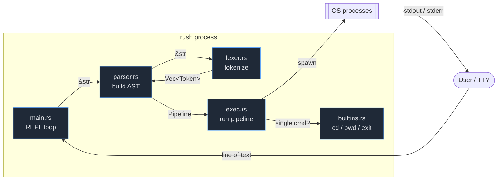
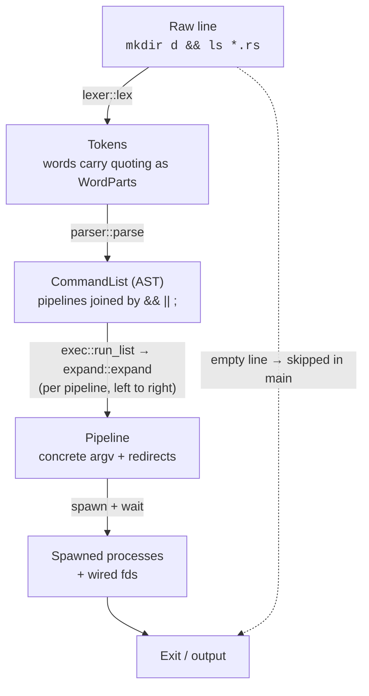
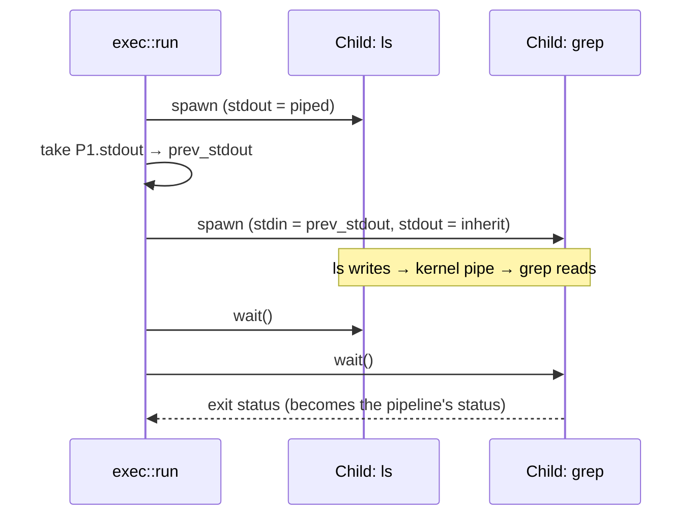
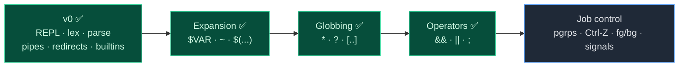

# rush — Architecture

This document describes how `rush` is structured and how a line of input flows
from your keyboard to a running process and back.

- [1. Overview](#1-overview)
- [2. The processing pipeline](#2-the-processing-pipeline)
- [3. Module reference](#3-module-reference)
- [4. Data model](#4-data-model)
- [5. Execution model](#5-execution-model)
- [6. Worked example](#6-worked-example)
- [7. Design decisions](#7-design-decisions)
- [8. Roadmap](#8-roadmap)

---

## 1. Overview

`rush` is a classic **read → parse → execute** shell. There is no background
thread, event loop, or async runtime: the main thread blocks on a line of
input, transforms it through a series of pure-ish stages, executes it, then
loops.

The codebase is intentionally small (~490 lines) and split along the stages of
that pipeline, so each module has a single, well-defined responsibility.



> Note: `parser::parse` is the public entry point; it calls `lexer::lex`
> internally. `main` never talks to the lexer directly.

---

## 2. The processing pipeline

Every non-empty line travels through a small chain of transformations. Each
stage has a narrow contract and surfaces errors as a `Result`, which `main`
reports without crashing the shell.



| Stage | Function | Input | Output | Fails on |
|---|---|---|---|---|
| Lex | `lexer::lex` | `&str` | `Vec<Token>` | unterminated `"`, unterminated `$(` |
| Parse | `parser::parse` | `&str` | `CommandList` | dangling `\|`, missing redirect target, empty command, `&` |
| Run list | `exec::run_list` | `&CommandList` | `i32` (status) | propagated from expand/exec |
| Expand | `expand::expand` | `&RawPipeline` | `Pipeline` | unterminated `${`/`$(`, sub-command parse error |
| Execute | `exec::run` | `&Pipeline` | `(i32, String)` | spawn failure, missing redirect file |
| Builtin | `builtins::try_run` | `&[String]` | `Option<i32>` | — (errors printed inline) |

Expansion sits deliberately between parse and exec, and runs **lazily, one
pipeline at a time** as `run_list` walks the list left to right — so `cd d &&
ls *` globs in the new directory. The parser preserves each word's quoting
(single-quoted text is literal, double-quoted and bare text may expand), and the
expansion stage resolves `~`, `$VAR`/`${VAR}`, `$(...)`, and filename globs
(`*`, `?`, `[…]`) against the environment, sub-shells, and the filesystem before
a process is spawned. Globbing can turn one word into several arguments, so the
stage is a flat-map, not a one-to-one map.

The control operators `&&`, `||`, and `;` have equal precedence and associate
left to right; `run_list` decides whether to run each pipeline from the previous
one's exit status (`&&` needs `0`, `||` needs non-zero, `;` always runs).

---

## 3. Module reference

### `main.rs` — the REPL
Owns the read-eval-print loop and all I/O concerns:
- Builds the prompt from the current working directory (`cwd $ `).
- Loads `~/.rush_history` at startup and saves it on exit.
- Translates `rustyline` signals: **Ctrl-C** (`Interrupted`) abandons the line
  and continues; **Ctrl-D** (`Eof`) on an empty line breaks the loop.
- Delegates parsing and execution, printing any error as `rush: …` to stderr
  without exiting.

### `lexer.rs` — tokenizer
A hand-written, single-pass scanner over a `Peekable<Chars>`. It produces a flat
`Vec<Token>`, stripping quote *characters* but **preserving quote context** as
`WordPart`s so the expansion stage knows what may expand:
- **Single quotes** (`'…'`) and **backslash** escapes become `Literal` parts —
  never expanded.
- **Double quotes** (`"…"`) become `Quoted` parts; backslash escapes `"`, `\`,
  and `$`.
- Bare text becomes `Unquoted` parts (eligible for `~`, `$`, and later glob).
- A `$(...)` substitution is swallowed whole — balanced parens, quotes and all —
  so inner spaces and `|` don't split the word.
- Operators `|`, `<`, `>`, `>>` become distinct tokens; `>>` is detected by
  peeking after `>`.
- Lexer errors: an unterminated double quote or an unterminated `$(`.

### `parser.rs` — grammar
Consumes tokens into a `CommandList` — a `first` pipeline plus `(Connector,
pipeline)` pairs, words still unexpanded. The grammar (v0):
```
list     := pipeline ( (';' | '&&' | '||') pipeline )* ';'?
pipeline := command ( '|' command )*
command  := word+ redirection*
redirect := ('<' | '>' | '>>') word
```
- `parse_pipeline` builds one pipeline, stopping (without consuming) at a
  control operator or end of input.
- `Word` tokens append to the current command's `argv` (each a `Vec<WordPart>`).
- `Pipe` finalizes the current command (erroring if it's empty) and starts a new
  one via `std::mem::replace`.
- Redirect operators consume the following word as a filename (`expect_word`),
  erroring if it isn't a word.
- A trailing empty command (`ls |`), an empty pipeline between operators
  (`a ;; b`), and single `&` (background, not yet supported) are all rejected.

### `expand.rs` — expansion
Lowers a `RawPipeline` into an `exec::Pipeline` of concrete strings:
- **Tilde:** a leading `~` on the first, unquoted part of a word becomes `$HOME`
  (falling back to `$USERPROFILE`); `~user` is left untouched.
- **Variables:** `$VAR` and `${VAR}` read the environment; unset → empty.
- **Command substitution:** `$(...)` re-enters `parse → expand` on the inner
  text and runs it via `exec::capture`, inlining stdout with trailing newlines
  trimmed.
- **Globbing:** each word is also assembled as a glob *pattern* in lock-step
  with its plain text, escaping metacharacters that came from quoted/literal
  parts so only unquoted `*?[` stay active. If the pattern matches files
  (via `glob::glob`), the sorted matches replace the word; otherwise the
  literal text is kept (POSIX no-match).
- **Quoting / emptiness:** `Literal` parts pass through verbatim; `Quoted`/
  `Unquoted` parts are scanned for `$`. A word that is entirely unquoted and
  expands to empty (e.g. `$UNSET`) drops out, mirroring shell field-splitting;
  a quoted empty (`""`) is kept. Whitespace word-splitting of results is *not*
  done yet.

### `glob.rs` — filename matching
A from-scratch globber, no external crate:
- `match_component` matches one path component with `*` (within a component),
  `?`, `[…]` (ranges and `[!…]`/`[^…]` negation); a backslash escapes the next
  character so quoted metacharacters are literal.
- `glob` walks the filesystem component-by-component, so `src/*.rs` and
  `*/*.rs` descend directories. A leading `.` in a filename matches only when
  the pattern component begins with a literal `.`, so `*` skips dotfiles.

### `exec.rs` — runtime
Sequences a `CommandList` and turns each pipeline into running processes:
- `run_list` walks the list left to right, expanding each `RawPipeline` *just
  before* it runs and using `should_run(connector, prev_status)` to honour
  `&&`/`||`/`;`. It returns the status of the last pipeline that ran.
- `capture_list` mirrors that but concatenates each pipeline's stdout into a
  string — the engine behind `$(...)`.
- **Single-command fast path:** if a pipeline is one command, try
  `builtins::try_run` first so `cd`/`exit` affect the shell process (skipped
  when capturing, so substitutions see external commands).
- Otherwise `run` spawns each stage with `std::process::Command`, threading the
  previous child's stdout into the next child's stdin.
- Redirection rules per stage: an explicit `< file` / `> file` / `>> file`
  **wins** over pipe wiring; otherwise non-final stages get a piped stdout and
  the final stage inherits the terminal (or is captured).
- After spawning all stages, it waits on each child; the pipeline's status is
  the last stage's exit code.

### `builtins.rs` — in-process commands
`try_run` returns `Some(code)` if `argv[0]` is a builtin, else `None`:
- `cd [dir]` — changes the shell's own working directory (no arg → `$HOME`).
- `pwd` — prints the current directory.
- `exit [code]` — terminates the process (diverges; defaults to `0`).

These **must** run in-process: a `cd` executed in a child would change the
child's directory and die with it, leaving the shell where it was.

---

## 4. Data model

The data model is a small, owned AST in two layers: the parser's **raw** form,
where words keep their quoting (`Vec<WordPart>`), and exec's **resolved** form,
where every word is a concrete `String`. The expansion stage maps the first onto
the second. There is no borrowing from the input string, which keeps lifetimes
simple at v0 scale.

```mermaid
classDiagram
    class Token {
        <<enum>>
        Word(Vec~WordPart~)
        Pipe
        Less
        Great
        DGreat
    }
    class WordPart {
        <<enum>>
        Literal(String)
        Unquoted(String)
        Quoted(String)
    }
    class CommandList {
        +RawPipeline first
        +Vec~(Connector, RawPipeline)~ rest
    }
    class Connector {
        <<enum>>
        Seq
        And
        Or
    }
    class RawPipeline {
        +Vec~RawCommand~ commands
    }
    class RawCommand {
        +Vec~Word~ argv
        +Vec~RawRedirect~ redirects
    }
    class Pipeline {
        +Vec~Command~ commands
    }
    class Command {
        +Vec~String~ argv
        +Vec~Redirect~ redirects
    }
    class Redirect {
        <<enum>>
        Stdin(String)
        Stdout(file, append)
    }

    Token *-- WordPart
    CommandList "1" *-- "1..*" RawPipeline
    CommandList ..> Connector : joins with
    RawPipeline "1" *-- "1..*" RawCommand
    Pipeline "1" *-- "1..*" Command
    Command "1" *-- "0..*" Redirect
    Token ..> RawCommand : parsed into
    RawPipeline ..> Pipeline : expand::expand
```

A `Pipeline` always has at least one `Command` (the parser guarantees this).
Each `Command` carries its full `argv` (program + arguments) and any redirects,
in source order. When multiple redirects of the same kind appear, exec uses the
**last** one (`.rev().find_map(...)`), matching shell semantics like
`cmd > a > b` writing to `b`.

---

## 5. Execution model

The interesting part is how exec wires file descriptors across pipeline stages.
For each stage it decides stdin and stdout independently:


Pipe wiring across two stages looks like this:



Key properties:
- All stages are spawned **before** any `wait()`, so they run concurrently and
  the kernel pipe buffer provides back-pressure — exactly like a real shell.
- The **last** stage's exit code is the pipeline's status, which feeds the
  `&&`/`||` decision in `run_list`. (v0 does not yet expose it as `$?`.)

---

## 6. Worked example

Input: `cat log.txt | grep ERROR >> errors.txt`

1. **Lex** →
   `[Word("cat"), Word("log.txt"), Pipe, Word("grep"), Word("ERROR"), DGreat, Word("errors.txt")]`
2. **Parse** → `CommandList { first: Pipeline { commands: [`
   - `RawCommand { argv: [["cat"], ["log.txt"]], redirects: [] }`,
   - `RawCommand { argv: [["grep"], ["ERROR"]], redirects: [Stdout { "errors.txt", append: true }] }`
   `] }, rest: [] }` (one pipeline, no operators)
3. **Run list / Expand** → the single pipeline is expanded (here a no-op — no
   `$`, `~`, or globs) into the concrete `Pipeline` of `String` argv.
4. **Execute**
   - Not a single command → skip builtins.
   - Stage 0 `cat log.txt`: stdin inherits, stdout = piped (not last).
   - Stage 1 `grep ERROR`: stdin = stage 0's pipe, stdout = `errors.txt` opened
     with `append=true, truncate=false` (explicit redirect beats pipe-to-next).
   - Wait on both; `grep`'s exit code becomes the pipeline's (and the list's)
     status.

---

## 7. Design decisions

- **Tokens carry no positions.** v0 errors are descriptive strings, not spans.
  Good enough for a REPL; revisit if we add multi-line input.
- **Owned `String`s throughout the AST.** Avoids lifetime plumbing; the input
  line is small and short-lived, so the allocation cost is irrelevant.
- **Builtins only in the single-command fast path.** A builtin mid-pipeline
  (`echo hi | cd x`) is rare and semantically fuzzy; v0 punts and would try to
  exec `cd` as an external program (which fails) — documented, not fixed.
- **Errors never kill the shell** (except `exit`). Parse and exec failures print
  to stderr and the loop continues, matching interactive-shell expectations.
- **No `nix`/`libc` yet.** Everything uses `std`. Real job control (process
  groups, `tcsetpgrp`, signal forwarding) will require dropping to `nix`, which
  is the main architectural change on the horizon.

---

## 8. Roadmap

Ordered roughly by dependency and effort:



| Milestone | Touches | Notes |
|---|---|---|
| Variable & tilde expansion | ✅ `expand.rs`, between parse and exec | `$VAR`, `${VAR}`, `~`, command substitution `$(...)`; no word-splitting yet |
| Globbing | ✅ `glob.rs`, driven from the expansion stage | `*`, `?`, `[…]` with ranges/negation, multi-component, dotfile rule |
| Control operators | ✅ lexer + parser `CommandList` + `exec::run_list` | `&&`, `\|\|`, `;` sequence/short-circuit by exit status |
| Job control | exec rewrite on `nix` | process groups, terminal control, `Ctrl-Z`/`fg`/`bg`, signal forwarding — the headline feature for daily use |
